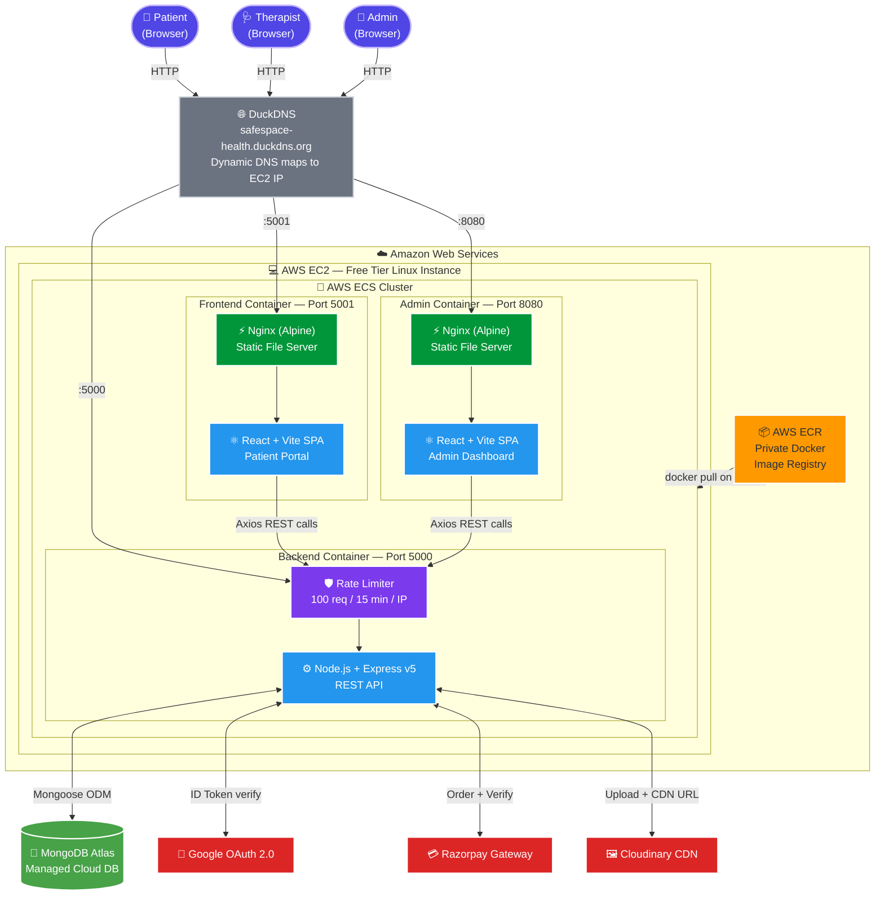
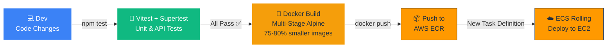

<div align="center">


<br/><br/>

# 🧠 SafeSpace

### Enterprise-Grade Mental Health Care Platform

**A fully containerized, cloud-native microservices application connecting patients with certified mental health professionals — built with production DevOps practices including CI, multi-stage Docker builds, Nginx reverse proxies, and AWS ECS/EC2 orchestration.**

<br/>

<!-- Tech Stack Badges -->


<br/>


<br/>


<br/>

[🌐 Live Demo](#-live-deployment) · [🏗️ Architecture](#️-system-architecture) · [✨ Features](#-key-features--tech-stack) · [🚀 Quick Start](#-local-development-setup) · [📂 Structure](#-project-structure)

</div>

---

## 📖 Overview

**SafeSpace** is a production-grade, full-stack mental health consultation platform built to demonstrate deep, end-to-end engineering across web development, cloud infrastructure, and DevOps. It enables patients to discover therapists, book appointments, and complete payments — while administrators manage the full ecosystem from a dedicated dashboard.

> **Key Engineering Decision:** Instead of deploying on platforms like Vercel or Render, the entire application is **manually containerized**, pushed to **AWS ECR**, and **orchestrated on AWS ECS/EC2** — mirroring how senior engineers ship software in top-tier product companies.

---

## ⚡ At a Glance

| Capability | Implementation |
|---|---|
| 🏗️ **Architecture** | Microservices — 3 fully decoupled Docker services |
| 🐳 **Containerization** | Multi-stage Docker builds with Alpine Linux (75–80% image size reduction) |
| ☁️ **Cloud Deployment** | AWS ECR → ECS → EC2 (Zero-downtime rolling updates) |
| 🔐 **Auth** | JWT + Google OAuth 2.0 + Bcrypt password hashing |
| 💳 **Payments** | Razorpay live payment gateway integration |
| 🛡️ **Security** | Express Rate Limiter (DDoS / brute-force protection) |
| 🧪 **Testing** | Vitest unit tests + Supertest for API integration tests |
| 📦 **Reverse Proxy** | Nginx serving compiled React SPAs — no Node.js overhead in production |
| 🖼️ **Media** | Cloudinary CDN — upload, optimize & deliver profile images |
| 🔒 **Domain** | DuckDNS dynamic DNS (Google OAuth domain policy compliant) |

---

## 🎯 How It Works — Three Role-Based Portals

### 👤 Patient Portal (User)
- **Onboarding** — Register with email/password **or** one-click login via **Google OAuth 2.0**
- **Profile Management** — Update personal details; profile photos uploaded & optimized via **Cloudinary**
- **Therapist Discovery** — Browse certified therapists, filter by specialty, view real-time available slots
- **Secure Payments** — Book appointments and pay instantly using the **Razorpay** payment gateway
- **Appointment History** — Track all past and upcoming consultations from a personal dashboard

### 🩺 Therapist Portal (Doctor)
- **Vetted Access** — No self-registration. Admins onboard all therapists, ensuring a quality-controlled network
- **Dedicated Dashboard** — View upcoming appointments, manage weekly availability, and track patient history
- **Secure Auth** — Separate JWT-protected login flow with bcrypt hashed credentials

### 👑 Admin Dashboard
- **Complete Platform Control** — Dedicated, protected portal for full ecosystem oversight
- **Doctor Management** — Exclusively responsible for vetting, adding, updating, and removing therapists
- **Global Oversight** — Monitor all appointments, users, and payment transactions platform-wide

---

## 🌐 Live Deployment

The platform is **actively deployed and publicly accessible** on AWS:

| Portal | URL | Technology |
|---|---|---|
| 📱 **Patient Portal** | [safespace-health.duckdns.org:5001](http://safespace-health.duckdns.org:5001) | React + Vite + Nginx |
| 🛡️ **Admin Dashboard** | [safespace-health.duckdns.org:8080](http://safespace-health.duckdns.org:8080) | React + Vite + Nginx |
| ⚙️ **Backend API** | [safespace-health.duckdns.org:5000](http://safespace-health.duckdns.org:5000) | Node.js + Express |

> ⚠️ Hosted on AWS EC2 Free Tier. Initial requests may take a few seconds to warm up the container.

---

## 🔑 Key Features & Tech Stack

### 🎨 Frontend — React + Vite + Nginx

| Technology | Role |
|---|---|
|  **React.js** | Component-based UI with hooks-based state management |
|  **Vite** | Sub-second HMR in development; optimized production bundles |
|  **Nginx** | High-performance static file serving; handles SPA client-side routing |
|  **Tailwind CSS** | Responsive, utility-first styling for a clean, accessible UI |
| **React Router DOM** | Seamless client-side navigation for a true SPA experience |
| **Axios** | Configured interceptors for secure HTTP requests & centralized error handling |

### ⚙️ Backend — Node.js + Express + MongoDB

| Technology | Role |
|---|---|
|  **Node.js** | Event-driven, non-blocking async runtime — handles high concurrency |
|  **Express.js v5** | Scalable REST API with clean resource routing (`/api/user`, `/api/admin`, `/api/doctor`) |
|  **MongoDB Atlas** | Managed NoSQL cloud database with replication & auto-scaling |
|  **Mongoose** | Strongly-typed schemas, model validation, and relationship management |
| **Multer** | Multipart form-data parsing for file/image upload handling |

### 🔐 Security & Authentication

| Technology | Role |
|---|---|
|  **Google OAuth 2.0** | Passwordless login via `google-auth-library` token verification |
|  **JSON Web Tokens** | Stateless, signed tokens for all protected API endpoints |
| **Bcrypt.js** | Cryptographic password hashing (salt rounds) — plaintext never stored |
| **Express Rate Limiter** | DDoS & brute-force protection — 100 req/15 min per IP address |
|  **Razorpay** | Production payment gateway with server-side order creation and payment verification |

### ☁️ DevOps, Cloud & Infrastructure

| Technology | Role |
|---|---|
|  **Docker** | Every service containerized with a custom `Dockerfile` |
| **Docker Compose** | Single `docker-compose.yml` spins up all 3 services locally with one command |
| **Multi-Stage Builds** | Stage 1: Node.js compiles React. Stage 2: Nginx serves the static bundle — heavy `node_modules` never shipped to production |
|  **Alpine Linux** | `node:20-alpine` + `nginx:alpine` shrinks images by **~75–80%** (from ~1 GB → ~150 MB), cutting ECR storage and ECS pull times dramatically |
|  **Nginx** | Reverse proxy + SPA routing configuration (`try_files $uri /index.html`) |
|  **AWS ECR** | Private Docker registry for versioned, immutable image storage |
|  **AWS ECS** | Container orchestrator managing task definitions and service health checks |
|  **AWS EC2** | Linux host instance (Free Tier) providing compute for ECS task placement |
| **Zero-Downtime Deploy** | ECS rolling update strategy — new container starts before old one stops |
|  **Vitest + Supertest** | Automated unit & integration tests powering the CI pipeline |
|  **Cloudinary** | Cloud media platform for image upload, transformation & CDN delivery |
| **DuckDNS** | Dynamic DNS mapping EC2 IP → `safespace-health.duckdns.org` for OAuth domain policy compliance |

---

## 🏗️ System Architecture

The diagram below shows the complete request lifecycle — from browser to cloud infrastructure to data layer — across all three decoupled microservices.



### 🔄 CI / Deployment Pipeline



---

## 🐳 Docker Architecture Deep-Dive

### Multi-Stage Build (Frontend & Admin)

```dockerfile
# ── STAGE 1: BUILD ─────────────────────────────────────────
FROM node:20-alpine AS builder      # ~120 MB — includes npm + dev tools

WORKDIR /app
COPY package*.json ./
RUN npm ci                           # Install ALL deps (devDeps needed for build)
COPY . .
RUN npm run build                    # Vite compiles React → /app/dist/

# ── STAGE 2: SERVE ─────────────────────────────────────────
FROM nginx:alpine                   # ~8 MB — hardened, minimal Linux

# Copy ONLY the compiled static assets — node_modules DISCARDED
COPY --from=builder /app/dist /usr/share/nginx/html
COPY nginx.conf /etc/nginx/conf.d/default.conf

EXPOSE 80
CMD ["nginx", "-g", "daemon off;"]
```

> **Result:** Final image is `~25–30 MB` instead of `~1 GB+`. Build tools and `node_modules` are **fully discarded** from the production image.

### Backend Build (Node.js)

```dockerfile
FROM node:20-alpine

WORKDIR /app
COPY package*.json ./
RUN npm ci --only=production         # No devDependencies in production
COPY . .

EXPOSE 5000
CMD ["node", "Server.js"]
```

### Service Port Mapping

| Service | Internal (Container) | External (Host/EC2) |
|---|---|---|
| 🌐 Frontend | `:80` (Nginx) | `:5001` |
| 🛡️ Admin | `:80` (Nginx) | `:5174` (local) · `:8080` (AWS) |
| ⚙️ Backend API | `:5000` (Node.js) | `:5000` |

---

## 🛡️ Security Architecture

```
┌─────────────────────────────────────────────────────────────┐
│                    Security Layers                           │
├─────────────────────────────────────────────────────────────┤
│  1. Rate Limiter       → 100 req / 15 min / IP (DDoS guard) │
│  2. Google OAuth 2.0   → Server-side ID Token verification  │
│  3. JWT Auth Guard     → Signed tokens, middleware-verified  │
│  4. Bcrypt (10 rounds) → Salted & hashed passwords          │
│  5. Mongoose Schemas   → Input validation at the model layer │
│  6. CORS Policy        → Whitelist-only origin enforcement   │
│  7. Admin Role Guard   → Separate auth middleware per route  │
└─────────────────────────────────────────────────────────────┘
```

---

## 🚀 Local Development Setup

### ✅ Prerequisites

- [Git](https://git-scm.com/)
- [Docker Desktop](https://www.docker.com/products/docker-desktop/) *(for Docker route)*
- [Node.js v20+](https://nodejs.org/) *(for manual route)*

### 1️⃣ Clone the Repository

```bash
git clone https://github.com/vivekanandpandey27/SafeSpace.git
cd SafeSpace
```

### 2️⃣ Configure Environment Variables

Create a `.env` file inside **each** service folder:

<details>
<summary><strong>📍 backend/.env</strong></summary>

```env
PORT=5000
MONGODB_URI=mongodb+srv://<username>:<password>@cluster.mongodb.net/safespace
JWT_SECRET=your_super_secret_jwt_string
CLOUDINARY_CLOUD_NAME=your_cloudinary_name
CLOUDINARY_API_KEY=your_cloudinary_api_key
CLOUDINARY_API_SECRET=your_cloudinary_api_secret
RAZORPAY_KEY_ID=your_razorpay_key_id
RAZORPAY_KEY_SECRET=your_razorpay_key_secret
FRONTEND_URL=http://localhost:5173
ADMIN_URL=http://localhost:5174
```
</details>

<details>
<summary><strong>📍 frontend/.env</strong></summary>

```env
VITE_BACKEND_URL=http://localhost:5000
VITE_RAZORPAY_KEY_ID=your_razorpay_key_id
VITE_GOOGLE_CLIENT_ID=your_google_oauth_client_id.apps.googleusercontent.com
```
</details>

<details>
<summary><strong>📍 admin/.env</strong></summary>

```env
VITE_BACKEND_URL=http://localhost:5000
VITE_CURRENCY=₹
```
</details>

### 3️⃣ Run the Application

#### 🐳 Option A — Docker Way *(Recommended — mirrors production)*

```bash
docker compose up --build
```

> Takes ~2–3 min on first run. Alpine images are pulled, React apps compiled, and all 3 services boot in parallel.

#### 💻 Option B — Manual (Native Node.js)

```bash
# Terminal 1 — Backend API
cd backend && npm install && node Server.js

# Terminal 2 — Patient Frontend
cd frontend && npm install && npm run dev

# Terminal 3 — Admin Dashboard
cd admin && npm install && npm run dev
```

#### 🧪 Option C — Run Tests

```bash
cd backend
npm test              # Run all Vitest unit + Supertest integration tests
npm run test:watch    # Watch mode during development
```

### 4️⃣ Access Locally

| Portal | URL |
|---|---|
| 📱 Patient Portal | http://localhost:5173 |
| 🛡️ Admin Dashboard | http://localhost:5174 |
| ⚙️ Backend API | http://localhost:5000 |

---

## 📂 Project Structure

```
SafeSpace/
├── backend/                    # ⚙️  Node.js + Express REST API
│   ├── controllers/            #    Route handler business logic
│   ├── models/                 #    Mongoose schemas (User, Doctor, Appointment)
│   ├── routes/                 #    API endpoints (/user, /admin, /doctor)
│   ├── middlewares/            #    JWT auth guard, rate limiter, multer config
│   ├── config/                 #    DB connection, Cloudinary, Razorpay setup
│   ├── tests/                  #    Vitest + Supertest test suites
│   ├── Dockerfile              #    Alpine-based Node.js production container
│   └── Server.js               #    Express application entry point
│
├── frontend/                   # ⚛️  React + Vite — Patient Portal SPA
│   ├── src/
│   │   ├── components/         #    Reusable UI components (NavBar, Cards, etc.)
│   │   ├── pages/              #    Route-level page components
│   │   └── context/            #    React Context for global app state
│   ├── nginx.conf              #    SPA routing (try_files $uri /index.html)
│   └── Dockerfile              #    Multi-stage: Node builder → Nginx server
│
├── admin/                      # 🛡️  React + Vite — Admin Dashboard SPA
│   ├── src/
│   ├── nginx.conf
│   └── Dockerfile              #    Same multi-stage Alpine build pattern
│
├── docker-compose.yml          # 🐳  Local multi-service orchestration (3 services)
└── README.md
```

---

## 🧪 Testing Strategy

| Layer | Tool | What is Tested |
|---|---|---|
| **Unit Tests** | Vitest | Business logic, utility functions, model validation |
| **Integration Tests** | Supertest | Full HTTP request → response cycle for all API endpoints |
| **Test Isolation** | `cross-env NODE_ENV=test` | Separate test DB connection, no production data touched |

```bash
cd backend
npm test
```

---

## 🧭 Roadmap

- [x] Google OAuth 2.0 passwordless login
- [x] Razorpay live payment gateway
- [x] Docker + Docker Compose multi-service orchestration
- [x] Multi-stage Alpine builds (75–80% image compression)
- [x] AWS ECR private registry + ECS orchestration + EC2 hosting
- [x] Nginx reverse proxy for production SPA serving
- [x] Vitest + Supertest automated test suite
- [x] Express Rate Limiter (DDoS & brute-force protection)
- [x] Cloudinary CDN image management
- [ ] GitHub Actions CI/CD (auto ECR push + ECS deploy on `git push`)
- [ ] WebSocket real-time chat (patients ↔ therapists)
- [ ] Video consultations (WebRTC)
- [ ] Multi-region AWS deployment for reduced latency
- [ ] Prometheus + Grafana observability dashboard

---

## 👨‍💻 Developer Notes — Why These Choices?

| Decision | Reason |
|---|---|
| **Manual AWS over Vercel/Render** | To demonstrate hands-on containerization, registry management, and cloud orchestration — skills valued at top product companies |
| **Microservices over Monolith** | True fault isolation — if the Admin panel crashes, the Patient portal stays fully operational |
| **Alpine Linux** | ~75–80% image size reduction → faster ECR pulls, lower storage costs, quicker ECS task startup |
| **Multi-Stage Docker Builds** | `node_modules` and build tools never ship to production — cleaner, smaller, more secure containers |
| **Vitest over Jest** | Native ES module support, faster execution, first-class Vite/Node.js ecosystem alignment |
| **Rate Limiter** | Every public API needs DDoS and brute-force protection — non-negotiable in production systems |
| **DuckDNS** | Google OAuth requires a stable domain (not a raw EC2 IP) — DuckDNS bridges the gap for free |

---

<div align="center">

**Designed, developed, and deployed with passion 💙**

*Full-Stack · DevOps · Cloud Native · Production Ready*

⭐ If you found this project useful or impressive, consider giving it a star!

[](https://github.com/vivekanandpandey27/SafeSpace)

</div>
