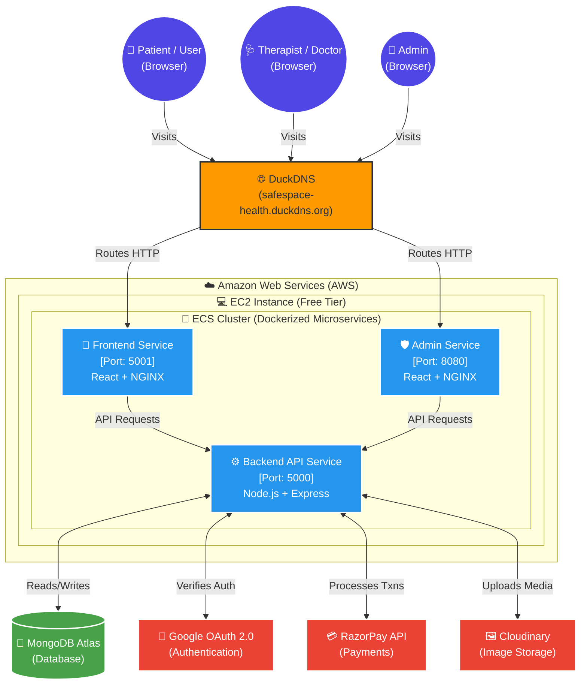

<div align="center">
  
  
  <h1>🧠 SafeSpace — Mental Health Care Platform</h1>
  
  <p>
    <strong>A highly scalable, fully containerized Microservices platform connecting patients with certified mental health professionals.</strong>
  </p>

  [](https://aws.amazon.com/)
  [](https://www.docker.com/)
  [](https://reactjs.org/)
  [](https://nodejs.org/)
  [](https://www.mongodb.com/)
</div>

<br/>

## 📖 Overview

**SafeSpace** is an enterprise-grade, full-stack mental health consultation platform built from the ground up with modern cloud-native principles. Engineered to handle high traffic securely, it allows patients to seamlessly browse therapists, book appointments, and process payments, while providing an extensive Admin Dashboard for platform management.

The entire infrastructure is broken down into a **Microservices Architecture**, packaged inside ultra-lightweight Docker containers, and orchestrated on **Amazon Web Services (AWS)** for maximum uptime and reliability.

---

## 🎯 How It Works (Platform User Flows)

The platform is designed with three distinct user roles, each with their own secure portals and specific capabilities:

### 👤 1. Patients (Users)
- **Onboarding:** Users can securely create an account using traditional email/password or log in instantly via **Google OAuth 2.0**.
- **Profile Management:** Users can update their personal details and seamlessly upload a profile picture (optimized and stored via Cloudinary).
- **Booking Flow:** Users browse through a curated list of certified therapists, filter by specialty, and view available calendar slots.
- **Secure Payments:** Once an open slot is selected, users securely pay for the appointment in real-time using the **RazorPay** integration.

### 🩺 2. Therapists (Doctors)
- **Strict Onboarding:** To maintain medical integrity, therapists *cannot* sign up publicly. They must be vetted by platform administrators. Upon approval, the Admin creates their account and provisions their Login ID and Password.
- **Dashboard:** Once logged in, therapists have access to a specialized dashboard to view upcoming appointments, manage their availability, and track their patient consultations.

### 👑 3. Administrators (Platform Managers)
- **Total Control:** Admins possess full oversight over the entire ecosystem through a dedicated, protected portal.
- **Doctor Management:** Admins are exclusively responsible for vetting, adding, updating, and removing therapists from the platform.
- **Global Oversight:** Admins can view, track, and manage all appointments, user data, and financial transactions across the platform.

---

## 🌐 Live Deployment URLs

The platform is actively deployed and running on the internet. Experience it live:

*   📱 **Patient Portal (Frontend):** [http://safespace-health.duckdns.org:5001](http://safespace-health.duckdns.org:5001)
*   🛡️ **Admin Dashboard:** [http://safespace-health.duckdns.org:8080](http://safespace-health.duckdns.org:8080)
*   ⚙️ **Backend API Server:** [http://safespace-health.duckdns.org:5000](http://safespace-health.duckdns.org:5000)

*(Note: Hosted on AWS EC2 Free Tier. Services may take a few seconds to wake up upon first request).*

---

## 🔑 Key Methods, Features, & Technologies Used

Every piece of technology in this project was chosen to mirror real-world, senior-level industry standards. 

### 🎨 Frontend & UI Experience
*   **React.js & Vite:** Lightning-fast client-side rendering with instant hot-module replacement during development.
*   **Tailwind CSS:** Highly responsive, utility-first styling for a beautiful, modern, and accessible user interface.
*   **React Router DOM:** Seamless Client-Side Routing for a true Single Page Application (SPA) experience.
*   **Axios:** Configured interceptors for secure HTTP requests and centralized error handling.

### ⚙️ Backend & API Engineering
*   **Node.js & Express.js:** Highly scalable, asynchronous backend API handling all business logic.
*   **MongoDB Atlas & Mongoose:** Fully managed NoSQL database using rigid Mongoose schemas for data integrity and complex aggregations.
*   **RESTful Architecture:** Clean, stateless API endpoints organized by resources (`/api/admin`, `/api/user`, `/api/doctor`).
*   **Express Rate Limiter:** Advanced DDoS protection. Explicitly configured to limit IPs to 100 requests per 15 minutes, preventing brute-force login attempts.

### 🔐 Authentication, Security & Payments
*   **Google OAuth 2.0:** Deep integration with `@react-oauth/google` allowing users to bypass traditional signups and log in instantly via Google.
*   **JSON Web Tokens (JWT):** Secure, stateless authentication mechanism. Tokens are securely generated and verified across all restricted endpoints.
*   **Bcrypt.js:** Advanced cryptographic hashing of all user and admin passwords before database insertion.
*   **RazorPay Gateway:** Production-ready payment gateway integration for secure, real-time appointment booking and transaction tracking.

### ☁️ DevOps, Cloud & Infrastructure (The Crown Jewel)
*   **Microservices Architecture:** Frontend, Admin, and Backend are 100% decoupled. If the Admin portal crashes, the Patient portal remains fully operational.
*   **Docker & Docker Compose:** Every service is containerized. `docker-compose.yml` orchestrates the entire cluster locally with a single command.
*   **Multi-Stage Docker Builds:** Optimized Dockerfiles that compile React code in Stage 1, then discard all heavy `node_modules` in Stage 2.
*   **Alpine Linux Compression:** Utilized `node:20-alpine` and `nginx:alpine` to shrink Docker images by **~75-80%** (from >1GB down to ~150MB), massively reducing AWS storage costs and deployment times.
*   **NGINX Reverse Proxy:** High-performance web server acting as a static file server and router for the compiled React applications.
*   **AWS Elastic Container Registry (ECR):** Secure, private AWS vault where our compiled Docker images are tagged and stored.
*   **AWS Elastic Container Service (ECS):** The brain of the operation. Orchestrates our containers, ensuring they are always running.
*   **AWS EC2 Launch Type:** Hosted on a custom EC2 instance to maximize free-tier usage while maintaining full control over the host machine.
*   **Zero-Downtime Rolling Updates:** Configured ECS Deployments with a `0% Minimum Healthy Percent` to allow graceful container replacement without exceeding EC2 memory limits.
*   **Continuous Integration (CI):** Implemented **Vitest** for automated unit testing, forming the foundational layer of a robust CI/CD pipeline.
*   **Cloudinary Integration:** External cloud media management for uploading, optimizing, and serving therapist and user profile pictures instantly.
*   **Dynamic DNS (DuckDNS):** Mapped the raw AWS IPv4 address to a clean, professional domain name (`safespace-health.duckdns.org`) to satisfy strict Google OAuth domain origin policies.

---

## 🏗️ System Architecture & Cloud Infrastructure Flow

Below is the high-level architecture demonstrating how the decoupled Microservices communicate through the AWS Cloud environment, securely connecting the end-users to the database and third-party APIs.




---

## 🚀 Local Development Setup

Want to run the entire cluster on your local machine? It takes less than 5 minutes.

### 1. Prerequisites
- [Docker Desktop](https://www.docker.com/products/docker-desktop/) installed and running.
- Git installed.

### 2. Clone the Repository
```bash
git clone https://github.com/vivekanandpandey27/SafeSpace.git
cd SafeSpace
```

### 3. Environment Variables
Create a `.env` file in all three directories (`/backend`, `/frontend`, `/admin`) based on the provided `.env.example` templates. You will need:
- MongoDB Connection String
- Cloudinary API Keys
- RazorPay API Keys
- Google OAuth Client ID
- JWT Secret String

### 4. Fire It Up!
Leverage Docker Compose to build and start the entire Microservices cluster in one command:
```bash
docker compose up --build
```
*Wait 2-3 minutes for Docker to download the Alpine Linux images and install dependencies.*

### 5. Access the Platform
- **Frontend:** `http://localhost:5173`
- **Admin:** `http://localhost:5174`
- **Backend API:** `http://localhost:5000`

---

## 👨‍💻 Developer Notes & Conclusion

This project was built to bridge the gap between frontend web development and hardcore Cloud/DevOps engineering. By intentionally avoiding simple platforms like Vercel or Render, and instead choosing to manually containerize and orchestrate the application on raw AWS infrastructure, this project demonstrates a deep, fundamental understanding of how modern enterprise software is actually delivered to the world.

*Designed, developed, and deployed with passion.* 💙
