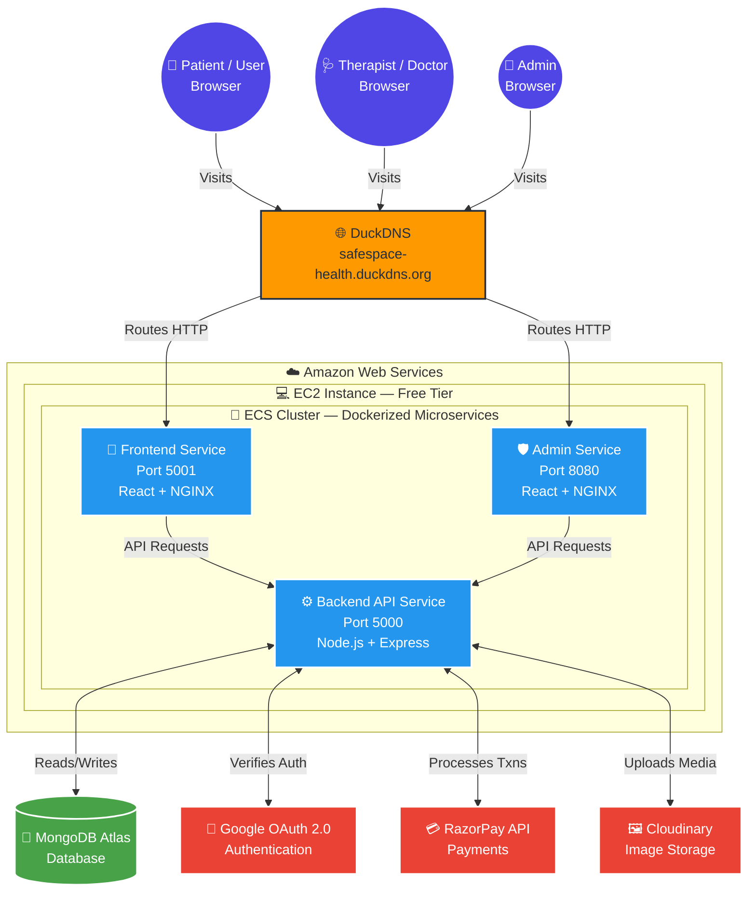

<div align="center">

# 🧠 SafeSpace
### Enterprise-Grade Mental Health Care Platform

**A fully containerized, cloud-native microservices platform connecting patients with certified mental health professionals — engineered for scale, security, and reliability.**

[](https://aws.amazon.com/)
[](https://www.docker.com/)
[](https://reactjs.org/)
[](https://nodejs.org/)
[](https://www.mongodb.com/)

[Live Demo](#-live-deployment) · [Features](#-key-features--tech-stack) · [Architecture](#️-system-architecture) · [Setup Guide](#-local-development-setup) · [Tech Stack](#-key-features--tech-stack)

</div>

<br/>

## 📖 Overview

**SafeSpace** is a full-stack mental health consultation platform built from the ground up on modern cloud-native principles. It enables patients to seamlessly discover therapists, book appointments, and complete secure payments — all while giving administrators a powerful dashboard to manage the entire ecosystem.

The platform is broken down into a **microservices architecture**, packaged inside lightweight Docker containers, and orchestrated on **Amazon Web Services (AWS)** for maximum uptime, security, and scalability.

> This project was built to demonstrate deep, real-world proficiency across both full-stack web development and production-grade DevOps/Cloud engineering — not just to build an app, but to deploy it the way modern enterprise software actually ships.

<br/>

## ✨ Highlights

| 🏗️ Microservices | 🐳 Fully Dockerized | ☁️ AWS ECS/EC2 | 🔐 JWT + OAuth 2.0 | 💳 Live Payments |
|:---:|:---:|:---:|:---:|:---:|
| Decoupled frontend, admin & backend | Multi-stage Alpine builds | Zero-downtime rolling deploys | Bcrypt + Google Sign-In | RazorPay integration |

<br/>

## 🎯 How It Works

SafeSpace supports **three distinct user roles**, each with a dedicated, secure portal tailored to their responsibilities.

### 👤 Patients (Users)
- **Onboarding** — Sign up with email/password or log in instantly via **Google OAuth 2.0**.
- **Profile Management** — Update personal details and upload a profile picture (optimized & stored via Cloudinary).
- **Booking Flow** — Browse certified therapists, filter by specialty, and view real-time available slots.
- **Secure Payments** — Book and pay for appointments instantly using the **RazorPay** gateway.

### 🩺 Therapists (Doctors)
- **Vetted Onboarding** — Therapists cannot self-register. Admins vet and create their accounts, provisioning secure login credentials.
- **Dedicated Dashboard** — View upcoming appointments, manage availability, and track patient consultations.

### 👑 Administrators
- **Total Platform Control** — Full oversight through a dedicated, protected portal.
- **Doctor Management** — Exclusively responsible for vetting, adding, updating, and removing therapists.
- **Global Oversight** — View and manage all appointments, users, and financial transactions platform-wide.

<br/>

## 🌐 Live Deployment

The platform is actively deployed and publicly accessible:

| Portal | URL |
|---|---|
| 📱 **Patient Portal** | [safespace-health.duckdns.org:5001](http://safespace-health.duckdns.org:5001) |
| 🛡️ **Admin Dashboard** | [safespace-health.duckdns.org:8080](http://safespace-health.duckdns.org:8080) |
| ⚙️ **Backend API** | [safespace-health.duckdns.org:5000](http://safespace-health.duckdns.org:5000) |

> ⚠️ **Note:** Hosted on the AWS EC2 Free Tier. Services may take a few seconds to spin up on first request.

<br/>

## 🔑 Key Features & Tech Stack

Every technology in this stack was deliberately chosen to mirror real-world, senior-level industry standards.

### 🎨 Frontend & UI Experience
- **React.js & Vite** — Lightning-fast rendering with instant hot-module replacement in development.
- **Tailwind CSS** — Responsive, utility-first styling for a clean, modern, accessible UI.
- **React Router DOM** — Seamless client-side routing for a true Single Page Application (SPA) experience.
- **Axios** — Configured interceptors for secure HTTP requests and centralized error handling.

### ⚙️ Backend & API Engineering
- **Node.js & Express.js** — Scalable, asynchronous backend handling all business logic.
- **MongoDB Atlas & Mongoose** — Fully managed NoSQL database with rigid schemas for data integrity and complex aggregations.
- **RESTful Architecture** — Clean, stateless endpoints organized by resource (`/api/admin`, `/api/user`, `/api/doctor`).
- **Express Rate Limiter** — DDoS protection, limiting IPs to 100 requests per 15 minutes to prevent brute-force attacks.

### 🔐 Authentication, Security & Payments
- **Google OAuth 2.0** — Integrated via `@react-oauth/google` for instant, passwordless login.
- **JSON Web Tokens (JWT)** — Secure, stateless authentication across all protected endpoints.
- **Bcrypt.js** — Cryptographic hashing of all user and admin passwords before storage.
- **RazorPay Gateway** — Production-ready payment integration for real-time appointment booking.

### ☁️ DevOps, Cloud & Infrastructure — *The Crown Jewel*
- **Microservices Architecture** — Frontend, Admin, and Backend are 100% decoupled; if the Admin portal fails, the Patient portal stays fully operational.
- **Docker & Docker Compose** — Every service containerized; the entire cluster spins up locally with one command.
- **Multi-Stage Docker Builds** — Compiles React in Stage 1, discards heavy `node_modules` in Stage 2.
- **Alpine Linux Compression** — `node:20-alpine` & `nginx:alpine` shrink images by **~75–80%** (1GB+ → ~150MB), cutting AWS storage costs and deployment time.
- **NGINX Reverse Proxy** — High-performance static file serving and routing for compiled React apps.
- **AWS ECR** — Secure, private registry for versioned Docker images.
- **AWS ECS** — Orchestrates containers, ensuring continuous uptime.
- **AWS EC2 (Free Tier)** — Custom instance maximizing free-tier usage with full host control.
- **Zero-Downtime Rolling Updates** — ECS deployments configured with `0% Minimum Healthy Percent` for graceful replacement within EC2 memory limits.
- **CI with Vitest** — Automated unit testing as the foundation of a robust CI/CD pipeline.
- **Cloudinary** — Cloud media management for instant image upload, optimization, and delivery.
- **Dynamic DNS (DuckDNS)** — Maps the AWS IP to a clean domain (`safespace-health.duckdns.org`), satisfying Google OAuth's strict domain policies.

<br/>

## 🏗️ System Architecture

The diagram below shows how the decoupled microservices communicate across the AWS cloud environment, connecting end-users to the database and third-party APIs.



<br/>

## 🚀 Local Development Setup

Two supported paths: **The Docker Way** (recommended, one command) or **The Manual Way** (run each service with native Node/React scripts).

### ✅ Prerequisites
- [Git](https://git-scm.com/)
- [Docker Desktop](https://www.docker.com/products/docker-desktop/) — for the Docker route
- [Node.js v20+](https://nodejs.org/en) — for the manual route

### 1️⃣ Clone the Repository
```bash
git clone https://github.com/vivekanandpandey27/SafeSpace.git
cd SafeSpace
```

### 2️⃣ Configure Environment Variables

Create a `.env` file inside **each** of the three service folders (`backend`, `frontend`, `admin`):

<details>
<summary><strong>📍 backend/.env</strong></summary>

```env
PORT=5000
MONGODB_URI=mongodb+srv://<your_username>:<your_password>@cluster.mongodb.net/safespace
JWT_SECRET=your_super_secret_jwt_string
CLOUDINARY_CLOUD_NAME=your_cloudinary_name
CLOUDINARY_API_KEY=your_cloudinary_api_key
CLOUDINARY_API_SECRET=your_cloudinary_api_secret
RAZORPAY_KEY_ID=your_razorpay_key_id
RAZORPAY_KEY_SECRET=your_razorpay_key_secret
FRONTEND_URL=http://localhost:5173
ADMIN_URL=http://localhost:5174
```
</details>

<details>
<summary><strong>📍 frontend/.env</strong></summary>

```env
VITE_BACKEND_URL=http://localhost:5000
VITE_RAZORPAY_KEY_ID=your_razorpay_key_id
VITE_GOOGLE_CLIENT_ID=your_google_oauth_client_id.apps.googleusercontent.com
```
</details>

<details>
<summary><strong>📍 admin/.env</strong></summary>

```env
VITE_BACKEND_URL=http://localhost:5000
VITE_CURRENCY=₹
```
</details>

### 3️⃣ Run the Application

#### 🐳 Option A — The Docker Way *(Recommended)*
Replicates the production cloud environment locally.

```bash
docker compose up --build
```
*(Takes 2–3 minutes to pull Alpine images, install dependencies, and boot all services.)*

#### 💻 Option B — The Manual Way
Open **three separate terminals**:

```bash
# Terminal 1 — Backend
cd backend
npm install
node Server.js
```
```bash
# Terminal 2 — Frontend
cd frontend
npm install
npm run dev
```
```bash
# Terminal 3 — Admin
cd admin
npm install
npm run dev
```

### 4️⃣ Access the Platform

| Portal | Local URL |
|---|---|
| 📱 Patient Portal | http://localhost:5173 |
| 🛡️ Admin Dashboard | http://localhost:5174 |
| ⚙️ Backend API | http://localhost:5000 |

<br/>

## 📂 Project Structure

```
SafeSpace/
├── backend/          # Node.js + Express REST API
├── frontend/          # React + Vite patient portal
├── admin/             # React + Vite admin dashboard
├── docker-compose.yml # Local multi-service orchestration
└── README.md
```

<br/>

## 🧭 Roadmap

- [ ] Real-time chat between patients and therapists
- [ ] Video consultation support
- [ ] Automated CI/CD pipeline (GitHub Actions → ECR → ECS)
- [ ] Multi-region deployment for reduced latency

<br/>

## 👨‍💻 Developer Notes

This project bridges the gap between frontend web development and hardcore Cloud/DevOps engineering. By intentionally avoiding simplified platforms like Vercel or Render — and instead manually containerizing and orchestrating the application on raw AWS infrastructure — SafeSpace demonstrates a deep, practical understanding of how modern enterprise software is actually built and delivered.

<br/>

<div align="center">

**Designed, developed, and deployed with passion 💙**

⭐ If you found this project interesting, consider giving it a star!

</div>
